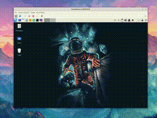

# 🖥️ x-resize
If you install any Linux system with the XFCE or MATE desktop environment in KVM using VirtManager, install Spice Agent and QEMU Guest Agent, and configure everything correctly, but the screen scaling still doesn't work after hours of Googling and making configuration changes, you almost start crying, you will be relieved to come across this repository. Wipe away your tears and sweat, read on, and you won't be disappointed!



## 💡 What it does

`x-resize` automatically adjusts your guest screen resolution when you resize the Virt-Manager window.

This repo provides **three installers**, kept stylistically consistent:

- **Kali XFCE**: dynamic resize + **absolute pointer fix** (evdev calibration).
- **Parrot MATE**: simple and fast RandR auto-resize. (only for Parrot 6 with Mate)
- **Generic XFCE/MATE (Xorg)**: portable RandR auto-resize (no evdev tweaks).

## 🧩 Requirements

Make sure your **VM guest** (Kali / Parrot / Debian / Ubuntu / etc.) has:

- `spice-vdagent`
- `qemu-guest-agent`
- **SPICE channel** added in Virt-Manager (`com.redhat.spice.0`)
- In **Virt-Manager** window:  
  ✔️ *View → Auto resize VM with window* = **ON**  
  ✔️ *View → Scale Display* = **ON**

> Works on **Xorg**. The scripts exit cleanly if a desktop ever switches to Wayland.

## ⚙️ Install (choose your desktop)

### 🐉 Kali Linux (XFCE) with evdev calibration

Recommended for 2025 builds.

Run the following as **your normal user**:

```bash
wget -O setup-x-resize-xfce-kali.sh https://raw.githubusercontent.com/h0ek/x-resize/refs/heads/main/setup-x-resize-xfce-kali.sh
chmod +x setup-x-resize-xfce-kali.sh
./setup-x-resize-xfce-kali.sh
```

🪄 This script:

- Installs (if missing): `x11-xserver-utils`, `x11-utils`, `xinput`, `xserver-xorg-input-evdev`
- Creates:
  - `~/.local/bin/x-resize-xfce`
  - `~/.config/systemd/user/x-resize-xfce.service`
  - **`/etc/X11/xorg.conf.d/70-tablet-evdev.conf`** (maps QEMU/SPICE tablets to **evdev** in **Absolute** mode)
- On each resize:
  - Runs `xrandr --auto`
  - Reads current `WxH`
  - Sets **Evdev Axis Calibration** (`0..W-1, 0..H-1`) to keep the pointer perfectly aligned
  - Applies a no-op transform to force Xorg to re-evaluate maps
- Enables a **systemd user service** (autostarts after login)

> **After install**: log out/in (or reboot) so Xorg loads the evdev InputClass.

### 🦜 Parrot OS <= 6 (MATE)

Run as **your normal user**:

```bash
wget -O setup-x-resize-mate.sh https://raw.githubusercontent.com/h0ek/x-resize/refs/heads/main/setup-x-resize-mate.sh
chmod +x setup-x-resize-mate.sh
./setup-x-resize-mate.sh
```

🪄 This script:

- Installs (if missing): `x11-xserver-utils`, `x11-utils`
- Creates:
  - `~/.local/bin/mate-x-autoresize`
  - `~/.config/systemd/user/mate-x-autoresize.service`
- On each resize: `xrandr --auto` on the active output
- Exits cleanly on Wayland
- Enables a **systemd user service**

### 🐧 Generic XFCE / MATE on Xorg (Debian/Ubuntu/etc.)

Run as **your normal user**:

```bash
wget -O setup-x-resize-xfce.sh https://raw.githubusercontent.com/h0ek/x-resize/refs/heads/main/setup-x-resize-xfce.sh
chmod +x setup-x-resize-xfce.sh
./setup-x-resize-xfce.sh
```

🪄 This script:

- Installs (if missing): `x11-xserver-utils`, `x11-utils`
- Creates:
  - `~/.local/bin/x-resize`
  - `~/.config/systemd/user/x-resize.service`
- On each resize: `xrandr --auto` on the active output
- No device reconfiguration (portable, minimal)
- Enables a **systemd user service**

## 🔍 How to check that it works

After installation:

```bash
systemctl --user status x-resize-xfce         # Kali XFCE variant
systemctl --user status mate-x-autoresize     # Parrot MATE variant
systemctl --user status x-resize              # Generic variant
```

Expected output:

```bash
Active: active (running)
```

Live logs:

```bash
journalctl --user -u x-resize-xfce -f
journalctl --user -u mate-x-autoresize -f
journalctl --user -u x-resize -f
```

On resize you should see e.g.:

```bash
[x-resize-xfce] xrandr --output Virtual-1 --auto
[x-resize-xfce] Calibrate QEMU QEMU USB Tablet -> 1809x1055
```

---

## 📜 What exactly is created

| Variant     | File / Package                                            | Purpose                                                |
| ----------- | --------------------------------------------------------- | ------------------------------------------------------ |
| Kali XFCE   | `~/.local/bin/x-resize-xfce`                              | RandR listener + **evdev axis calibration** per resize |
| Kali XFCE   | `~/.config/systemd/user/x-resize-xfce.service`            | systemd user unit                                      |
| Kali XFCE   | `/etc/X11/xorg.conf.d/70-tablet-evdev.conf`               | Force SPICE/QEMU tablets to **evdev** (Absolute)       |
| Kali XFCE   | `xserver-xorg-input-evdev`                                | Required to expose **Evdev Axis Calibration**          |
| Parrot MATE | `~/.local/bin/mate-x-autoresize`                          | RandR listener (`xrandr --auto`)                       |
| Parrot MATE | `~/.config/systemd/user/mate-x-autoresize.service`        | systemd user unit                                      |
| Generic     | `~/.local/bin/x-resize`                                   | RandR listener (`xrandr --auto`)                       |
| Generic     | `~/.config/systemd/user/x-resize.service`                 | systemd user unit                                      |
| All         | `x11-xserver-utils`, `x11-utils`, `xinput` (Kali variant) | Installed if missing                                   |

## 🧠 Troubleshooting

1. Session must be **Xorg**:

   ```bash
   echo $XDG_SESSION_TYPE   # should be x11
   ```

2. SPICE agent running:

   ```bash
   pgrep -a spice-vdagent
   ```

3. SPICE channel exists:

   ```bash
   ls -l /dev/virtio-ports | grep com.redhat.spice.0
   ```

4. Manual test:

   ```bash
   OUT="$(xrandr | awk '/ connected primary/{print $1;exit} / connected/{print $1;exit}')"
   xrandr --output "$OUT" --auto
   ```

5. **Pointer offset on Kali XFCE** (odd modes like `1809x1055`):

   - Use the **Kali XFCE** installer (evdev). It calibrates:  
     `Evdev Axis Calibration = 0..W-1, 0..H-1` after each resize.

   - Verify props after a resize:

     ```bash
     for d in "QEMU QEMU USB Tablet" "spice vdagent tablet"; do
       xinput --list-props "$d" | grep -E "Evdev Axis Calibration|Evdev Axis Inversion"
     done
     ```

## 🧰 Service management

Check service status:

```bash
systemctl --user status x-resize-xfce
systemctl --user status mate-x-autoresize
systemctl --user status x-resize
```

Restart:

```bash
systemctl --user restart x-resize-xfce
systemctl --user restart mate-x-autoresize
systemctl --user restart x-resize
```

Stop:

```bash
systemctl --user stop x-resize-xfce
systemctl --user stop mate-x-autoresize
systemctl --user stop x-resize
```

Disable (uninstall):

```bash
# Kali XFCE
systemctl --user disable --now x-resize-xfce
rm -f ~/.config/systemd/user/x-resize-xfce.service ~/.local/bin/x-resize-xfce
systemctl --user daemon-reload

# Parrot MATE
systemctl --user disable --now mate-x-autoresize
rm -f ~/.config/systemd/user/mate-x-autoresize.service ~/.local/bin/mate-x-autoresize
systemctl --user daemon-reload

# Generic
systemctl --user disable --now x-resize
rm -f ~/.config/systemd/user/x-resize.service ~/.local/bin/x-resize
systemctl --user daemon-reload
```

> The Kali variant also installs `/etc/X11/xorg.conf.d/70-tablet-evdev.conf`. Remove it only if you know you won’t need evdev calibration anymore:
>
> ```bash
> sudo rm -f /etc/X11/xorg.conf.d/70-tablet-evdev.conf
> ```

## 🧑‍💻 Credits & Inspiration

The solution is based on modifying and adapting what other people smarter than me have come up with:
- https://superuser.com/questions/1183834/no-auto-resize-with-spice-and-virt-manager
- https://unix.stackexchange.com/questions/117083/how-to-get-the-list-of-all-active-x-sessions-and-owners-of-them
- https://gitlab.freedesktop.org/xorg/app/xrandr/-/issues/71
- https://unix.stackexchange.com/questions/614027/how-to-enable-automatic-change-of-guest-resolution-to-fit-boxes-window
- https://nodal-notebook.aria-network.com/technical_advice/auto-adjusting-screen-resolutions-kvm-qemu-udev-spice/
- https://gitlab.xfce.org/xfce/xfce4-settings/-/issues/142
- https://gitlab.com/apteryks/x-resize
- https://github.com/seife/spice-autorandr
- https://logos-red.com/blog/how-to-fix-kali-linux-qemu-resize-issue/

# 🔎 Tested

| Distribution | Version  | Kernel | Desktop environment |
| ------------ | -------- | ------ | ------------------- |
| Parrot OS*    | 6.4      | 6.12.x | MATE 1.26           |
| Kali Linux   | 2025.3   | 6.12.x | XFCE 4.20           |
| Whonix       | 17.4.4.6 | 6.12.x | XFCE 4.20           |
| Debian       | 13.1     | 6.12.x | XFCE 4.20           |

*Since version 7, Parrot has been using KDE, so scaling works there without these scripts.
