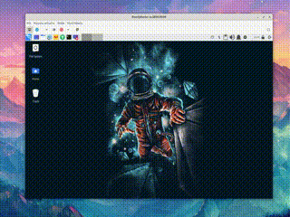

# 🖥️ x-resize
If you install any Linux system with the XFCE or MATE desktop environment in KVM using VirtManager, install Spice Agent and QEMU Guest Agent, and configure everything correctly, but the screen scaling still doesn't work after hours of Googling and making configuration changes, you almost start crying, you will be relieved to come across this repository. Wipe away your tears and sweat, read on, and you won't be disappointed!



## 💡 What it does

`x-resize` automatically adjusts your guest screen resolution when you resize the Virt-Manager window.

The repo now uses **one installer and one service** with four profiles:

- **Kali XFCE**: dynamic resize + **adaptive HiDPI resolution cap** + **absolute pointer fix** (evdev calibration).
- **Arch XFCE**: dynamic resize + **adaptive HiDPI resolution cap** + **absolute pointer fix** (evdev calibration).
- **Parrot MATE / MATE**: dynamic resize + **adaptive HiDPI resolution cap**.
- **Generic XFCE/MATE (Xorg)**: portable dynamic resize + **adaptive HiDPI resolution cap** (no evdev tweaks).

On normal window sizes, `x-resize` follows the SPICE-requested resolution as before. On very large HiDPI surfaces it limits the guest to a practical resolution instead of letting XFCE/MATE become microscopic.

Typical examples:

```text
3200x2000 -> 1920x1200
3840x2400 -> 1920x1200
3840x2160 -> up to 2560x1440
2560x1440 -> 2560x1440
smaller window -> matching smaller SPICE mode
```

The cap is based on the current SPICE guest surface, not hard-coded host monitor names, so the same VM can move between a HiDPI laptop panel and external displays without separate profiles or desktop shortcuts.

## 🧩 Requirements

Make sure your **VM guest** (Kali / Parrot / Debian / Ubuntu / etc.) has:

- `spice-vdagent`
- `qemu-guest-agent`
- **SPICE channel** added in Virt-Manager (`com.redhat.spice.0`)
- In **Virt-Manager** window:
  ✔️ *View → Auto resize VM with window* = **ON**
  ✔️ *View → Scale Display* = **ON**

> Works on **Xorg**. The runtime exits cleanly if a desktop ever switches to Wayland.

> On XFCE, display scale `1.0` is recommended. The adaptive HiDPI cap is intended to avoid fractional XFCE scaling just to make the guest usable on a high-resolution host display.

## ⚙️ Install (choose your desktop)

Run the installer as **your normal user**, not root:

```bash
wget -O x-resizer.sh https://raw.githubusercontent.com/h0ek/x-resize/refs/heads/main/x-resizer.sh
chmod +x x-resizer.sh
./x-resizer.sh
```

Without parameters, the installer detects your OS/desktop, recommends a profile and shows a small menu. If you prefer no questions:

```bash
./x-resizer.sh auto
```

You can also choose a profile explicitly.

### 🐉 Kali Linux (XFCE) with evdev calibration

```bash
./x-resizer.sh kali
```

🪄 This profile:

- Installs (if missing): `x11-xserver-utils`, `x11-utils`, `xinput`, `xfconf`, `xserver-xorg-input-evdev`, `spice-vdagent` and `qemu-guest-agent` on KVM guests
- Creates:
  - `~/.local/bin/x-resize`
  - `~/.config/systemd/user/x-resize.service`
  - `~/.config/x-resize/config`
  - **`/etc/X11/xorg.conf.d/70-tablet-evdev.conf`** (maps QEMU/SPICE tablets to **evdev** in **Absolute** mode)
- On each resize:
  - Reads the SPICE/RandR requested mode
  - Keeps normal resolutions unchanged
  - Caps very large HiDPI modes to a practical resolution
  - Reads the final `WxH`
  - Sets **Evdev Axis Calibration** (`0..W-1, 0..H-1`) to keep the pointer aligned
- Enables the common **systemd user service**

> **After first install**: log out/in (or reboot) so Xorg loads the evdev InputClass.

### 🐧 Arch Linux (XFCE) with evdev calibration

```bash
./x-resizer.sh arch
```

🪄 This profile:

- Installs (if missing): `xorg-xrandr`, `xorg-xev`, `xorg-xinput`, `xfconf`, `xf86-input-evdev`, `spice-vdagent` and `qemu-guest-agent` on KVM guests
- Creates the same common runtime, config and `x-resize.service`
- Creates **`/etc/X11/xorg.conf.d/70-tablet-evdev.conf`**
- Uses the same adaptive resize logic as the other profiles
- Recalibrates **Evdev Axis Calibration** after the final mode is selected

> **After first install**: log out/in (or reboot) so Xorg loads the evdev InputClass.

### 🦜 Parrot OS (MATE) / MATE

```bash
./x-resizer.sh mate
```

🪄 This profile:

- Installs the required RandR/SPICE utilities if missing
- Creates:
  - `~/.local/bin/x-resize`
  - `~/.config/systemd/user/x-resize.service`
  - `~/.config/x-resize/config`
- Uses dynamic RandR resize with the adaptive HiDPI cap
- Does not change the input driver
- Exits cleanly on Wayland

### 🐧 Generic XFCE / MATE on Xorg (Debian/Ubuntu/etc.)

```bash
./x-resizer.sh generic
```

Aliases such as `debian` and `debian-xfce` are also accepted.

🪄 This profile:

- Installs the required RandR/SPICE utilities if missing
- Creates:
  - `~/.local/bin/x-resize`
  - `~/.config/systemd/user/x-resize.service`
  - `~/.config/x-resize/config`
- Uses dynamic RandR resize with the adaptive HiDPI cap
- No device reconfiguration (portable, minimal)
- Enables the common **systemd user service**

### 🤖 Automatic detection

```bash
./x-resizer.sh auto
```

The installer uses `/etc/os-release` and the current desktop environment. Kali XFCE and Arch-family XFCE select their evdev profiles, MATE selects the MATE profile, and other supported XFCE/MATE guests use the generic profile.

## 🔍 How to check that it works

After installation:

```bash
systemctl --user status x-resize
```

Expected output:

```bash
Active: active (running)
```

Or use the installer itself:

```bash
./x-resizer.sh status
```

Live logs:

```bash
journalctl --user -u x-resize -f
```

On resize you should see e.g.:

```text
[x-resize] request=3200x2000 cap=1920x1440 selected=1920x1200 output=Virtual-1
```

On Kali/Arch you may additionally see pointer calibration entries.

---

## 📜 What exactly is created

| Variant | File / Package | Purpose |
| ------- | -------------- | ------- |
| All | `~/.local/bin/x-resize` | Common RandR listener + adaptive HiDPI mode selection |
| All | `~/.config/systemd/user/x-resize.service` | Common systemd user unit |
| All | `~/.config/x-resize/config` | Installed profile and resize settings |
| Kali / Arch XFCE | `/etc/X11/xorg.conf.d/70-tablet-evdev.conf` | Force supported SPICE/QEMU tablets to **evdev** (Absolute) |
| Kali XFCE | `xserver-xorg-input-evdev` | Required to expose **Evdev Axis Calibration** |
| Arch XFCE | `xf86-input-evdev` | Required to expose **Evdev Axis Calibration** |

If an unrelated `/etc/X11/xorg.conf.d/70-tablet-evdev.conf` already exists, the installer backs it up before replacing it and restores it during uninstall.

## 🧠 Troubleshooting

1. Session must be **Xorg**:

   ```bash
   echo $XDG_SESSION_TYPE   # should be x11
   ```

2. SPICE agent running:

   ```bash
   pgrep -a spice-vdagent
   ```

3. SPICE channel exists:

   ```bash
   ls -l /dev/virtio-ports | grep com.redhat.spice.0
   ```

4. Watch what `x-resize` decides while resizing the window:

   ```bash
   journalctl --user -u x-resize -f
   ```

5. Check the current RandR state:

   ```bash
   xrandr --current
   ```

6. **Pointer offset on Kali/Arch XFCE**:

   - Use the `kali` or `arch` profile. It calibrates `Evdev Axis Calibration = 0..W-1, 0..H-1` after the final resize.

   - Verify props after a resize:

     ```bash
     for d in "QEMU QEMU USB Tablet" "spice vdagent tablet"; do
       xinput --list-props "$d" 2>/dev/null | grep -E "Evdev Axis Calibration|Evdev Axis Inversion"
     done
     ```

7. See the installed profile and service state:

   ```bash
   ./x-resizer.sh status
   ```

## 🧰 Service management

Check service status:

```bash
systemctl --user status x-resize
```

Restart:

```bash
systemctl --user restart x-resize
```

Stop:

```bash
systemctl --user stop x-resize
```

Live logs:

```bash
journalctl --user -u x-resize -f
```

Uninstall everything managed by x-resize:

```bash
./x-resizer.sh uninstall
```

The uninstaller removes the common service/runtime/configuration, restores a backed-up evdev InputClass when applicable, and cleans legacy x-resize service/script names from older releases. Packages installed as dependencies are intentionally left installed because they may be used by SPICE or other desktop software.

> The new installer also recognizes the old system-wide installation that used `/etc/systemd/system/x-resize.service` and `/usr/local/bin/x-resize`, so upgrading from an old build does not require remembering which historical installer you used.

## 🖼️ How adaptive HiDPI resizing works

`x-resize` runs **inside the VM guest** and reacts to the resolution that Virt-Manager/SPICE exposes through RandR. It does not hard-code your host monitor name, laptop model or dock.

The old approach effectively followed `xrandr --auto` all the way up. That works well on ordinary displays, but a HiDPI host can expose guest surfaces such as `3200x2000`, `3840x2160` or `3840x2400`. With XFCE/MATE at display scale `1.0`, the guest UI can then become ridiculously tiny. Fractional scaling inside XFCE may make the UI larger, but on some SPICE absolute-pointer setups it can also cause pointer offset, a duplicated cursor or stutter.

The unified runtime does **not** force `xrandr --auto` anymore. SPICE/virt-viewer is allowed to change the active RandR mode first, then `x-resize` observes the current mode and only replaces it when it exceeds the adaptive cap. This avoids a feedback race where `--auto` could briefly re-select a huge HiDPI mode after `x-resize` had already capped it.

The runtime reacts to both RandR screen-change and output-change notifications. It deliberately does not discard fast consecutive events with a time debounce, because SPICE can send a second mode change immediately after fullscreen/windowed transitions. Every resulting decision is idempotent: if the current mode is already acceptable, no mode change is made.

The unified runtime keeps automatic resize but adds an adaptive sanity cap:

- normal and smaller SPICE modes are kept unchanged
- large 16:10-ish surfaces typically top out around `1920x1200`
- large 16:9-ish surfaces can use up to `2560x1440`
- only modes currently advertised by the guest RandR output are selected
- the largest suitable mode close to the requested aspect ratio is preferred
- if no close-aspect mode exists, the largest sensible mode that fits is used
- moving the VM between displays, resizing the window, or switching fullscreen/windowed causes a fresh decision

Typical examples:

```text
3200x2000 -> 1920x1200
3840x2400 -> 1920x1200
3840x2160 -> up to 2560x1440
2560x1440 -> 2560x1440
smaller window -> matching smaller SPICE mode
```

This means XFCE can normally stay at **display scale `1.0`** while still remaining usable on a high-resolution laptop panel. Small black bars can occasionally appear for unusual tiled-window aspect ratios when the guest has no RandR mode with exactly the same proportions. That is intentional and preferable to stretching the image.

### GNOME / Hyprland host

The host desktop/compositor is separate from the guest runtime. `x-resize` can be used when Virt-Manager is running on **GNOME or Hyprland**, including a HiDPI/fractionally-scaled laptop display and external monitors. The resize decision is based on the SPICE guest surface, so moving the VM window between host displays does not require laptop-specific or monitor-specific profiles.

The **guest session itself still needs Xorg**, because `x-resize` uses RandR and the Kali/Arch profiles can additionally recalibrate Xorg evdev absolute-pointer coordinates. If the guest session is Wayland, the runtime exits cleanly.

## 🧑‍💻 Credits & Inspiration

The solution is based on modifying and adapting what other people smarter than me have come up with:
- https://superuser.com/questions/1183834/no-auto-resize-with-spice-and-virt-manager
- https://unix.stackexchange.com/questions/117083/how-to-get-the-list-of-all-active-x-sessions-and-owners-of-them
- https://gitlab.freedesktop.org/xorg/app/xrandr/-/issues/71
- https://unix.stackexchange.com/questions/614027/how-to-enable-automatic-change-of-guest-resolution-to-fit-boxes-window
- https://nodal-notebook.aria-network.com/technical_advice/auto-adjusting-screen-resolutions-kvm-qemu-udev-spice/
- https://gitlab.xfce.org/xfce/xfce4-settings/-/issues/142
- https://gitlab.com/apteryks/x-resize
- https://github.com/seife/spice-autorandr
- https://logos-red.com/blog/how-to-fix-kali-linux-qemu-resize-issue/
- https://github.com/flexbusterman (Arch version)

# 🔎 Tested

| Distribution | Version  |  Kernel   | Desktop environment |
| ------------ | -------- | --------- | ------------------- |
| Parrot OS    | 7.2      | >= 6.12.x | MATE >= 1.26        |
| Kali Linux   | 2026.1   | >= 6.12.x | XFCE >= 4.20        |
| Whonix       | 18.1.4.2 | >= 6.12.x | XFCE >= 4.20        |
| Debian       | 13.5     | >= 6.12.x | XFCE >= 4.20        |
| Arch Linux   | rolling  | >= 6.12.x | XFCE >= 4.20        |
